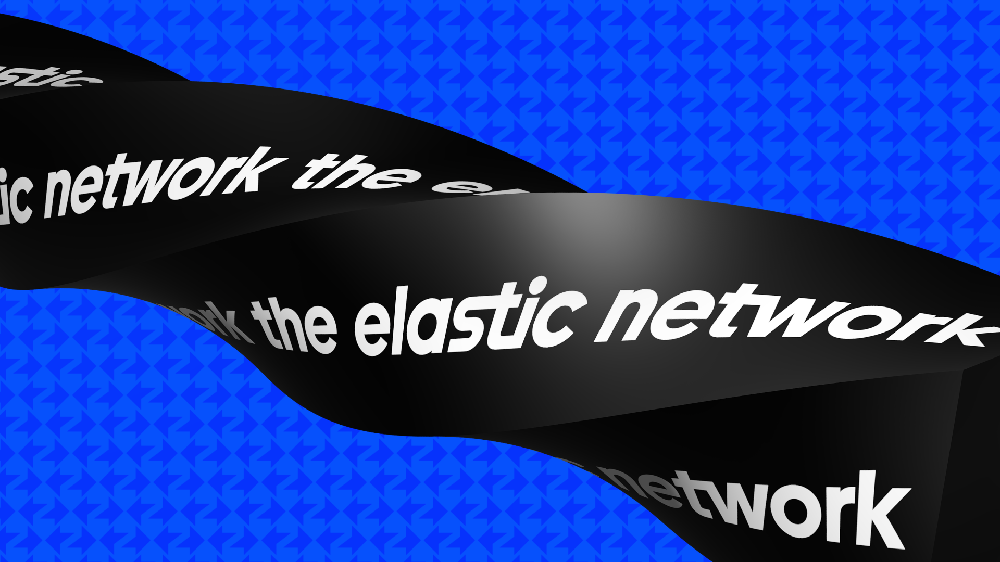

# **ZKsync Community Hub**  

  

Welcome to the **ZKsync Community Hub**, the home for developers, builders, and contributors working on **ZKsync, the Elastic Network**. Whether you're launching decentralized applications, developing new rollups, or just exploring the world of zero-knowledge, this is your place to connect, collaborate, and grow.  

---

## **🌐 What is the Elastic Network?**  

The **Elastic Network** is a **scalable ecosystem of ZK-powered chains**, built using the **ZK Stack**. It includes **live** and **upcoming** chains, each contributing to a decentralized, interoperable future.

### **🔹 Live Chains**  
➡️ **ZKsync Era**  
➡️ **Abstract**  
➡️ **Cronos zkEVM**  
➡️ **GRVT**  
➡️ **Sophon**  
➡️ **Treasure**  
➡️ **Zero Network**  

### **🔜 Upcoming Chains**  
🔜 **Creator**  
🔜 **Memento**  
🔜 **Space & Time**  
🔜 **PlayChain**  
🔜 **Lens**  
🔜 **ZKCandy**  
🔜 **zkLighter**  
🔜 **zkXPLA**  

Developers can **build, deploy, and scale applications seamlessly** across the Elastic Network, leveraging the power of **zero-knowledge proofs and interoperability**.  

---

## **🛠 For Developers**  

### **📢 Discussions Forum**  
The **[ZKsync Developers repository](https://github.com/zksync-community-hub/zksync-developers)** is the home for developers working on the Elastic Network.  

Join the **[Discussions forum](https://github.com/zksync-community-hub/zksync-developers/discussions)** to:  
✅ **Ask questions** about development and tooling.  
✅ **Get support** from the community and core contributors.  
✅ **Collaborate** on projects and share knowledge.  

---

### **📚 Tutorials & Community Code**  

Looking for **step-by-step guides** on building with ZKsync? Visit our **[Community Code repository](https://github.com/zkSync-Community-Hub/community-code)** for tutorials and code examples contributed by developers.  

📖 **Where tutorials are published:** [code.zksync.io](https://code.zksync.io/)  
✍️ **Want to contribute?** Submit a tutorial via a **Pull Request** to the [Community Code repo](https://github.com/zkSync-Community-Hub/community-code) so the entire ZKsync community can benefit!  

Whether you're creating **smart contracts, SDK integrations, or advanced ZK applications**, sharing your knowledge helps grow the ecosystem! 🚀  

---

### **📖 Developer Documentation**  

For in-depth technical details, check out our official documentation:  

📖 **[Developer Docs](https://docs.zksync.io/build)** – Learn how to build dApps on ZKsync.  
🏗 **[ZK Stack Docs](https://docs.zksync.io/zk-stack)** – Guides for deploying custom ZK chains.  
🔍 **[ZKsync Protocol Docs](https://docs.zksync.io/zksync-protocol)** – Deep dive into the protocol's architecture.  
⚙️ **[ZKsync Node Docs](https://docs.zksync.io/zksync-node)** – Running and managing ZKsync nodes.  

---

## **👥 Community & Contribution**  

The **[ZKsync Community portal](https://zknation.gitbook.io/zksync-community-hub)** is designed for everyone interested in the ZKsync ecosystem, from newcomers to seasoned builders. It provides:  

✅ **Official links & security tips** to stay safe in the ecosystem.  
✅ **Guidance on community engagement & contribution** best practices.  
✅ **Programs like the [ZKmentor Program](https://zknation.gitbook.io/zksync-community-hub/get-involved/zk-mentor)** to help new contributors.  
✅ **Testnet faucets** to support early-stage development.  

The community is built on **resilience, subtraction, and inclusion**, ensuring an open and decentralized future for ZKsync and the Elastic Network.  

---

## **🔄 Additional Resources**  

| **Resource** | **Description** |
|-------------|----------------|
| [🌐 ZKsync Website](https://zksync.io/) | Official ZKsync website with ecosystem updates. |
| [📢 ZKsync Twitter](https://twitter.com/zksync) | Follow us for the latest announcements. |
| [📢 ZKsync Developers Twitter](https://twitter.com/zkSyncDevs) | Follow us for developer-focused updates. |
| [💬 ZKsync Discord](https://join.zksync.dev/) | Join the community for live discussions. |

---

## **🙏 Thank You!**  

Your contributions make **the Elastic Network** stronger every day. Whether you're here to learn, get support, or help others, we’re glad to have you here!
